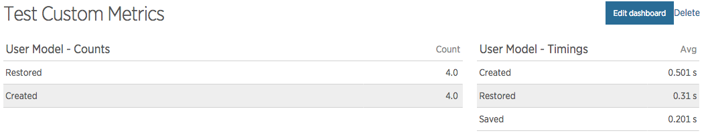

# Laravel 5 NewRelic Service Provider
*[see below for Laravel 4.x support](https://github.com/In-Touch/laravel-newrelic#laravel-4x-support)*

## Installation

Using `composer`, run:

    composer require intouch/laravel-newrelic:"~2.0"

Or add `intouch/laravel-newrelic` to your composer requirements:

    "require": {
        "intouch/laravel-newrelic": "~2.0"
    }

... and then run `composer install`

Once the package is installed, open your `app/config/app.php` configuration file and locate the `providers` key.  Add 
the following line to the end:

```php
'Intouch\LaravelNewrelic\NewrelicServiceProvider',
```

Optionally, locate the `aliases` key and add the following line:

```php
'Newrelic' => 'Intouch\LaravelNewrelic\Facades\Newrelic',
```

Finally, publish the default configuration (it will end up in `config/newrelic.php`):

    php artisan vendor:publish

## Configuration

Once the configuration from the package if published, see `config/newrelic.php` for configuration options and 
descriptions.

## Transaction Names

Naming is done by replacing tokens in a `name_provider` string with formatted output collected from the application.
The `newrelic.name_provider` config parameter holds this string - note that non-token string parts are left as-is.

| Token | Description | Example |
|-------|-------------|---------|
| {controller} | Controller / Action name                    | App\Http\Controllers\MyController@action |
| {method}     | HTTP Verb                                   | GET, POST |
| {route}      | Route Name if named, otherwise {controller} | auth.login |
| {path}       | Registered route path                       | /users/{id?} |
| {uri}        | Request URI path                            | /users/12345 |

The default `newrelic.name_provider` string is `'{uri} {route}'`.

## Eloquent Model Observers

There are two observer classes for monitoring your Eloquent models, the `NewrelicCountingObserver` and the
`NewrelicTimingObserver`.  As their names suggest, one counts the number of times observable model events happen and the
other gathers their timings (in milliseconds).  These recorded metrics will show up in your NewRelic Custom Metrics.

The `NewrelicCountingObserver` can be used for any observable model events, including your custom events.  The 
`NewrelicTimingObserver` currently only supports the built-in Eloquent observable events (see 
[Model Events](http://laravel.com/docs/5.0/eloquent#model-events) in the Laravel documentation).

Using the observers is simple - wherever you choose to register your model observers, simply add:

```php
User::observe(new \Intouch\LaravelNewrelic\Observers\NewrelicTimingObserver() );
User::observe(new \Intouch\LaravelNewrelic\Observers\NewrelicCountingObserver() );
```
    
... assuming you want to observe the `User` model.

Both observers take two optional parameters to their constructors: `$name` and `$care`.  `$name` is the name you want
to give to your custom metric, and if unset will default to the class name of the model object it is observing.  If you
want to change the `$care` array without changing the naming, simply pass `null` as the first constructor argument.

`$care` is an array of event names you want to care about.  This differs slightly between the *Counting* and
*Timing* observers.  For the *Counting* observer, any event can be counted independently.  For the *Timing*
observer, it uses the difference in time between `saving` and `saved` to submit the metric, so only the after-operation
events can be observed: `created`, `saved`, `updated`, `deleted`, `restored`.  This is also why custom observable events
are not supported for the *Timing* observer (yet ... working on it, we're happy to take PRs).

Per NewRelic's "best practice" suggestions, all metric names are prefaced with 'Custom/'.  The *Counting* observer 
also adds 'Counts/' to the name, while the *Timing* observer adds 'Timing/' to the name.  Both observers append
the event name to the end of the metric name.  Take as an example, using the *Counting* observer on the `User` model
monitoring the `created` event - the name would be: `Custom/Counts/App/User/created` (where `App/User` is the namespaced
class name of the observed model with slashes reversed for NewRelic metric paths, or will be whatever you set in `$name` 
if supplied).

It is safe to run these observers in integration tests or interactive test environments as long as 
`newrelic.throw_if_not_installed` is set to `false`.  Then if the NewRelic PHP Agent is not installed in that 
environment, the custom metrics will simply not be recorded.  If the NewRelic PHP Agent is installed in that 
environment, the metrics will be recorded.

The default events both observers care about are: `created`, `saved`, `updated`, `deleted`, `restored`.

**NOTE:** To use the observers, the `Newrelic` Facade must be loaded in your application configuration, not just the 
Service Provider.

**NOTE:** NewRelic restricts the total number of custom metrics you can have to 2000, and recommends less than 1000.

#### Example Custom Metrics Dashboard


## Basic Use

This package includes a Facade to the [Intouch/Newrelic](http://github.com/In-Touch/newrelic) class.  
Any of its methods may be accessed as any other Facade is accessed, for example:

    App::after( function() {
        Newrelic::setAppName( 'MyApp' );
    } );

... would set the NewRelic App Name to 'MyApp'

## Laravel 4.x Support

| Laravel Version | Package Tag | Supported |
|-----------------|-------------|-----------|
| 4.2.x | [1.1.5](https://github.com/In-Touch/laravel-newrelic/tree/1.1.5) | yes |
| 4.1.x | [1.1.5](https://github.com/In-Touch/laravel-newrelic/tree/1.1.5) | no |
| 4.0.x | [1.0.4](https://github.com/In-Touch/laravel-newrelic/tree/1.0.4) | no |
*we will review PRs for unsupported versions, but we don't use those versions in production ourselves so we aren't
testing / working on that*

## Issues

Before opening an issues for data not reporting in the format you have configured, please check your NewRelic PHP Agent 
logs and please see:
[https://discuss.newrelic.com/t/php-agent-4-19-0-disabled-3rd-party-service-provider-incorrectly/1666](https://discuss.newrelic.com/t/php-agent-4-19-0-disabled-3rd-party-service-provider-incorrectly/16667)

If that hasn't cleared things up, please open an issue here or send us a PR. 
